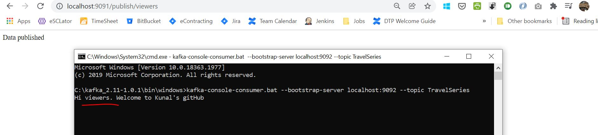
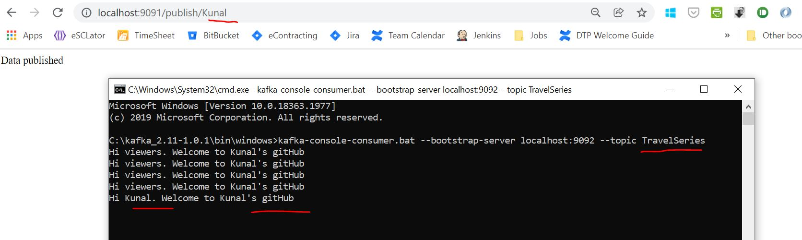
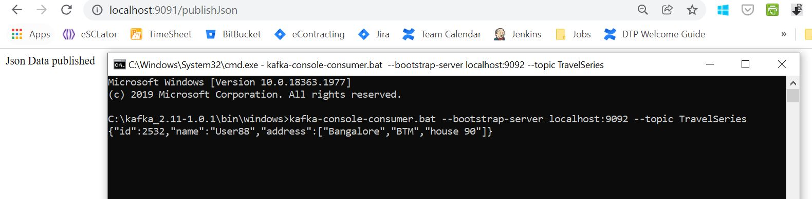

# kafka-publisher

https://archive.apache.org/dist/kafka/1.0.1/kafka_2.12-1.0.1.tgz

C:\kafka_2.11-1.0.1\bin\windows

start zookeeper
zookeeper-server-start.bat C:\kafka_2.11-1.0.1\config\zookeeper.properties

start kafkaserver
kafka-server-start.bat C:\kafka_2.11-1.0.1\config\server.properties

Create Topic
kafka-topics.bat --create --zookeeper localhost:2181 --replication-factor 1 --partitions 1 -topic TravelSeries

Output: Created topic "TravelSeries".

Run the application:
http://localhost:9091/publish/viewers

In case of error: Add this line below to C:\kafka_2.11-1.0.1\config\server.properties
listeners=PLAINTEXT://127.0.0.1:9092

After Running the above url:
Check in the consumers console , whether the data is published or not

kafka-console-consumer.bat --bootstrap-server localhost:9092 --topic TravelSeries

http://localhost:9091/publish/Kunal

Whatever msg you publish on the topic, same will be displayed on the console above for 
that topic.
-------------

Whenever you are going to work with plain text, you don't need to use KafkaPublisherConfigClass which we have
created now. So previous example was working without that.

When we are working with raw object, you need to provide key serializer and value serializer. And you need to manually
configure the KafkaTemplate as in the above mentioned class.

configs.put(ProducerConfig.KEY_SERIALIZER_CLASS_CONFIG, StringSerializer.class);
configs.put(ProducerConfig.VALUE_SERIALIZER_CLASS_CONFIG, JsonSerializer.class);

http://localhost:9091/publishJson

For more details: Visit: https://www.youtube.com/watch?v=clouToNoxGM&t=550s
